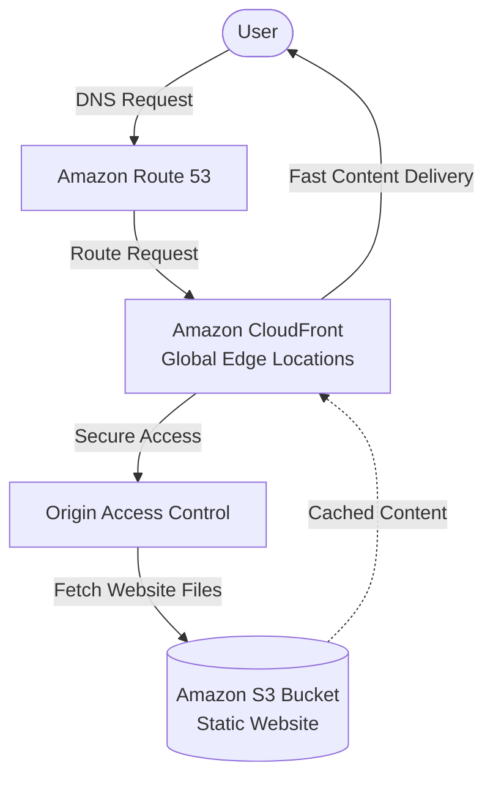

## Architecture

```mermaid
flowchart TD

    U([User])

    R53[Amazon Route 53]

    CF[Amazon CloudFront<br/>Global Edge Locations]

    OAC[Origin Access Control]

    S3[(Amazon S3 Bucket<br/>Static Website)]

    U -->|DNS Request| R53
    R53 -->|Route Request| CF
    CF -->|Secure Access| OAC
    OAC -->|Fetch Website Files| S3

    S3 -. Cached Content .-> CF
    CF -->|Fast Content Delivery| U
```
