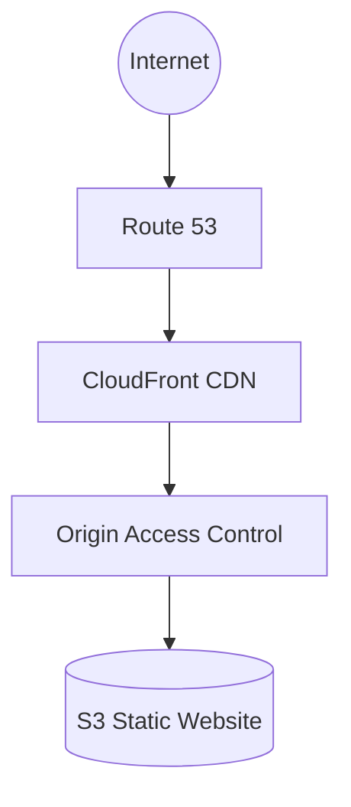
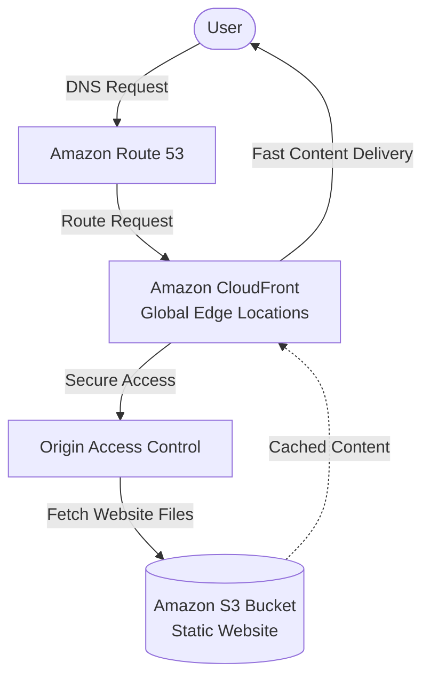

# AWS Secure Static Website Hosting with Amazon S3, CloudFront & Route 53

Host a secure, scalable, and cost-effective static website on AWS using Amazon S3, CloudFront, Route 53, and AWS Certificate Manager (ACM).

## Project Overview

This project demonstrates how to deploy a secure, production-ready static website on AWS without using a traditional web server.

The website is hosted in an Amazon S3 bucket and distributed globally through Amazon CloudFront. Amazon Route 53 manages DNS, while AWS Certificate Manager (ACM) provides a free SSL certificate for HTTPS encryption.

This architecture is ideal for portfolios, landing pages, business websites, and documentation sites because it is secure, highly available, scalable, and cost-effective.

**Live Website:** https://www.edwardfabunmi.online

# Architecture

## Table of Contents

- [Project Overview](#-project-overview)
- [Architecture](#️-architecture)
- [AWS Services Used](#aws-services-used)
- [Architecture Workflow](#architecture-workflow)
- [Prerequisites](#prerequisites)
- [Deployment Guide](#deployment-guide)
- [Security Features](#security-features)
- [Estimated Monthly Cost](#estimated-monthly-cost)
- [Lessons Learned](#lessons-learned)
- [Future Improvements](#future-improvements)
- [Screenshots](#screenshots)
- [Author](#author)

## AWS Services Used

- Amazon S3
- Amazon CloudFront
- Amazon Route 53
- AWS Certificate Manager (ACM)
- IAM
- Origin Access Control (OAC)

## Architecture Workflow

- An AWS Account
- A registered domain name (Namecheap, GoDaddy, etc.)
- Basic understanding of AWS services
- Static website files (HTML, CSS, JavaScript, Images)
